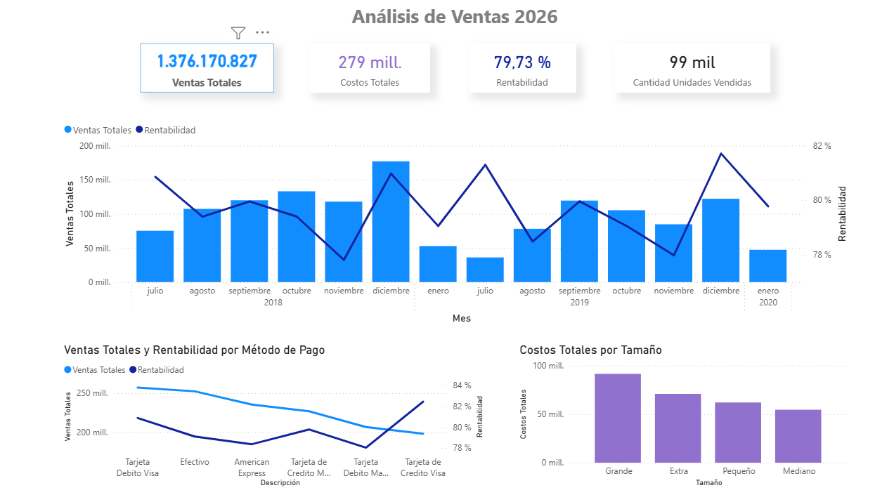
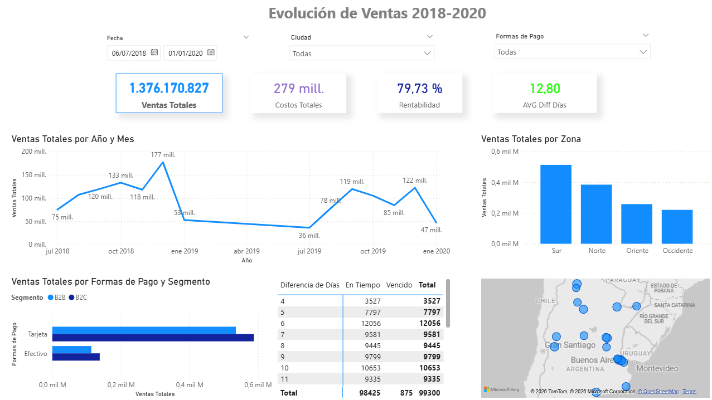

# Análisis de Ventas - Power BI

Dashboard interactivo desarrollado en Power BI para analizar el desempeño de ventas y apoyar a la toma de decisiones comerciales.

## Objetivo del proyecto

Construir un reporte de ventas interactivo que permita analizar el comportamiento del negocio mediante indicadores clave (KPIs), evolución temporal de las ventas y segmentación de la información.

El análisis se basa en un modelo de datos construido a partir de las tablas:

- Base de ventas
- Territorio
- Métodos de pago

## Herramientas utilizadas

- Power BI
- Modelado de datos
- DAX
- Visualización de datos

## Estructura del dashboard

El reporte está compuesto por dos páginas principales que permiten un análisis general y un análisis detallado de las ventas.

---

### 1. Overview

Vista ejecutiva que resume los principales indicadores del negocio.

Incluye los siguientes KPIs:

- Ventas Totales
- Costos Totales
- Rentabilidad
- Cantidad de unidades vendidas

Visualizaciones incluidas:

- Evolución de ventas y rentabilidad por mes y año
- Ventas totales por método de pago
- Costos totales por tamaño de producto
- Rentabilidad por zona
- Tooltips interactivos con información adicional

Esta página permite obtener rápidamente una visión general del desempeño comercial.

---

### 2. Detalle de Ventas

Vista de análisis detallado que permite explorar el comportamiento de las ventas utilizando filtros y segmentadores.

Segmentadores incluidos:

- Fecha (rango de fechas)
- Ciudad
- Formas de pago

Visualizaciones incluidas:

- Evolución de ventas por año y mes
- Ventas por zona geográfica
- Ventas por forma de pago y segmento (B2B / B2C)
- Matriz con cantidad de unidades vendidas según diferencia de días
- Mapa geográfico de ventas con latitud y longitud
- Tarjeta con promedio de diferencia de días con formato condicional

Esta sección permite profundizar en el análisis de ventas y detectar patrones o comportamientos del negocio.

---

## Principales insights

A partir del dashboard es posible analizar:

- Evolución de las ventas entre los años 2018 y 2020
- Diferencias en el volumen de ventas según zona geográfica
- Impacto de los distintos métodos de pago en las ventas
- Distribución de ventas entre segmentos B2B y B2C
- Comportamiento de los tiempos de pago a través de la diferencia de días

El uso de segmentadores permite realizar un análisis interactivo y dinámico de la información.

---

## Vista del dashboard

### Overview

### Detalle de ventas

---

## Archivos del proyecto

- `AnalisisVentas.pbix` → archivo completo del dashboard en Power BI
- `dashboard_Analisis-Ventas.pdf` → versión exportada del dashboard
- `dashboard_overview.png` → captura de la vista general
- `dashboard_detalle.png` → captura del análisis detallado
